# Title

```markdown
	Follow-the-Regularized-Leader and Mirror Descent: Equivalence Theorems and L1 Regularization
```

## Abstract

【原文】

```markdown
	We prove that many mirror descent algorithms for online convex optimization (such as online gradient descent) have an equivalent interpretation as follow-the-regularizedleader (FTRL) algorithms. This observation makes the relationships between many commonly used algorithms explicit, and provides theoretical insight on previous experimental observations. In particular, even though the FOBOS composite mirror descent algorithm handles L1 regularization explicitly, it has been observed that the FTRL-style Regularized Dual Averaging (RDA) algorithm is even more e ective at producing sparsity. Our results demonstrate that the key di erence between these algorithms is how they handle the cumulative L1 penalty. While FOBOS handles the L1 term exactly on any given update, we show that it is e ectively using subgradient approximations to the L1 penalty from previous rounds, leading to less sparsity than RDA, which handles the cumulative penalty in closed form. The FTRL-Proximal algorithm, which we introduce, can be seen as a hybrid of these two algorithms, and signi cantly outperforms both on a large, realworld dataset.
```

【译文】

```markdown
	我们证明了许多用于在线凸优化的镜像下降算法（例如在线梯度下降）具有与follow-the-regularizedleader (FTRL)算法等效的解释。该观察使许多常用算法之间的关系变得明确，并提供了对先前实验观察的理论见解。尤其是，即使FOBOS复合镜像下降算法可以明确处理L1正则化，也已经观察到FTRL样式的正则平均化（RDA）算法在产生稀疏性方面更为有效。我们的结果表明，这些算法之间的关键区别在于它们如何处理累积的L1损失。尽管FOBOS可以在任何给定的更新中精确地处理L1项，但我们证明它有效地使用了前几轮对L1罚分的次梯度近似，导致稀疏性低于RDA，后者以封闭形式处理累积罚分。我们介绍的FTRL-Proximal算法可以看作是这两种算法的混合体，在大型的真实数据集上均远胜过两者。
```

## 1 Introduction

【原文】

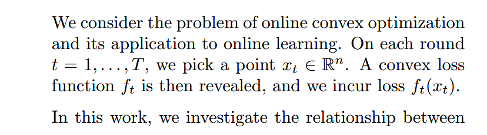

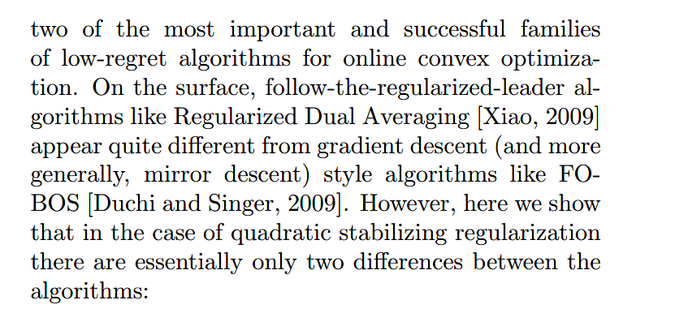

【译文】

​	我们考虑了在线凸优化的问题及其在在线学习中的应用。 在每一轮中，$t=1,...,T$，我们选择一个点$x_t\in R^n$。 然后揭示了凸损失函数$f_t$以及损失$f_t(x_t)$。在这项工作中，我们研究了在线凸优化的两个最重要且成功的低regret算法家族之间的关系。 从表面上看，诸如Regularized Dual Averaging [Xiao，2009]之类的正规化领导算法与FOBOS [Duchi and Singer，2009]等梯度下降（更普遍的是镜像下降）风格的算法似乎有所不同。 但是，这里我们表明，在二次稳定正则化的情况下，算法之间基本上只有两个区别：

【原文】

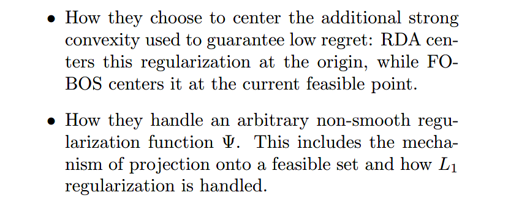

【译文】

* 它们如何选择将额外的强凸性用于保证低regret：RDA将正则化集中在原点，而FOBOS将正则化集中在当前可行点。
* 它们如何处理任意的非光滑正则化函数。这包括投影到可行集的机制以及如何处理L1正则化。

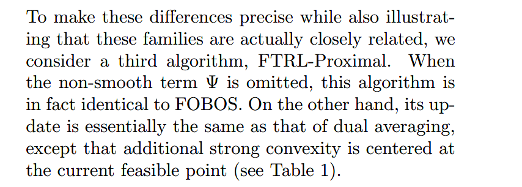

【译文】

​	为了使这些区别更精确，同时也说明这些家族实际上是密切相关的，我们考虑第三种算法，FTRL-Proximal。当省略非光滑项时，该算法实际上与FOBOS是相同的。另一方面，其更新与对偶平均的更新基本相同，只是增加的强凸性以当前可行点为中心(见表1)。

【表1】

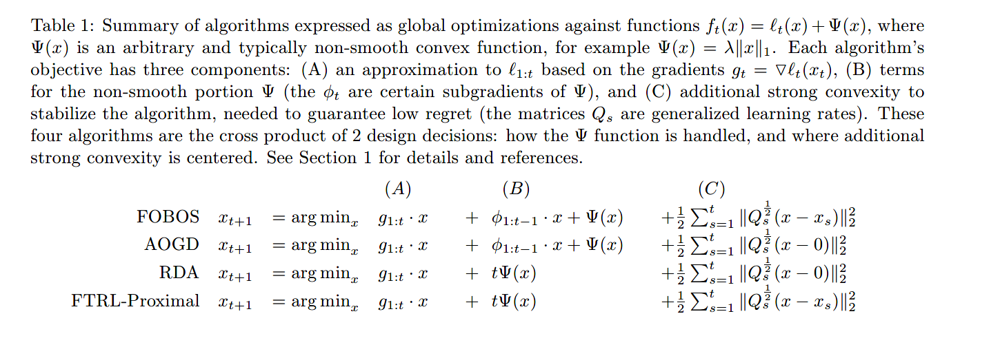

【原文】

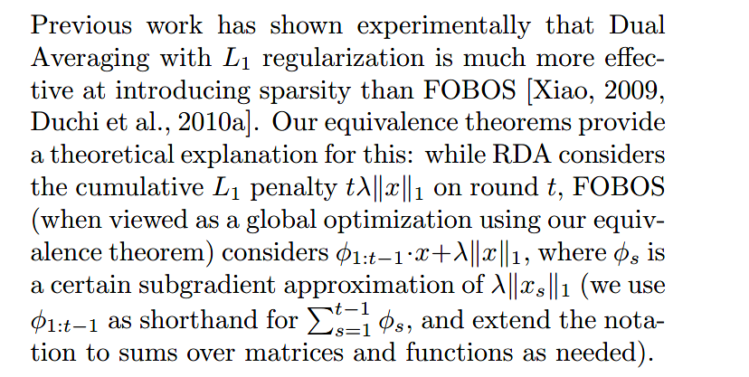

【译文】

​	先前的工作已通过实验表明，采用L1正则化进行对偶平均比引入FOBOS更有效地引入稀疏性[Xiao,2009,Duchi et al.,2010a]。我们的等价定理对此提供了理论上的解释：RDA考虑了第t轮的累积L1惩罚$ t\lambda ||x||_1 $，FOBOS（当使用等价定理视为全局优化时）考虑$\phi_{1:t-1}*x+\lambda||x||_1$，其中$\phi_s$是确定的$\lambda||x_s||_1$的次梯度近似（我们用$\phi_{1:t-1}$代表$\sum_{s=1}^{t-1}{\phi_s}$，并根据需要将表示法扩展为矩阵和函数的和）。

【原文】

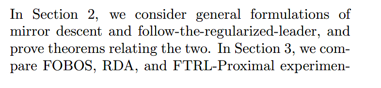

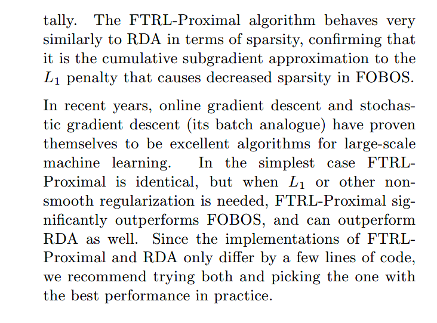

【译文】

​	在第2节中，我们考虑了镜像下降和遵循正则化领导的一般公式，并证明了与两者有关的定理。 在第3节中，我们将通过实验比较FOBOS，RDA和FTRL-Proximal。 FTRL-Proximal算法在稀疏性方面的行为与RDA非常相似，认为是L1罚则的累积次梯度近似导致FOBOS稀疏性降低。
​	近年来，在线梯度下降和随机梯度下降（其批次模拟）已证明自己是用于大规模机器学习的出色算法。 在最简单的情况下，FTLR-Proximal是相同的，但是当需要L1或其他不平滑的正则化时，FTRL-Proximal的性能明显优于FOBOS，并且也可以优于RDA。 由于FTRL-Proximal和RDA的实现仅需要几行代码，因此我们建议您尝试两者并在实践中选择性能最佳的代码。

### 算法

【原文】

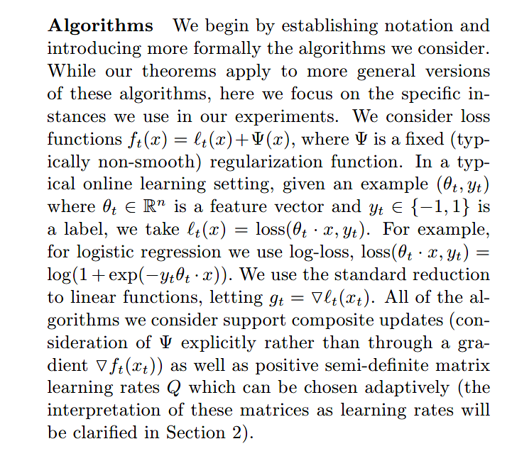

【译文】

​	我们首先建立符号并更正式地介绍我们考虑的算法。 虽然我们的定理适用于这些算法的更通用版本，但在这里我们集中于我们在实验中使用的特定实例。我们考虑损失函数$f_t(x)=l_t(x)+\Phi(x)$，其中$\Phi(x)$（通常不平滑）是固定的正则化函数。在典型的在线学习环境中，给定一个样本$(\theta_t,y_t)$，$\theta_t \in R^n$是特征向量，$y_t \in \{-1,1\}$是label，我们得到$l_t(x)=loss(\theta_tx,y_t)$。例如，对逻辑回归来说用的是log-loss，$loss(\theta_tx,y_t)=log(1+\exp(-y_t\theta_tx))$。对线性函数我们使用标准规约法，令$g_t=\nabla{l_t(x_t)}$。我们考虑的所有算法都支持复合更新（显示考虑$\Phi$而不是通过梯度$\nabla{f_t(x_t)}$以及可自适应选择的正半定学习率矩阵Q（将这些矩阵解释为学习率将在第2节中有说明））

【原文】

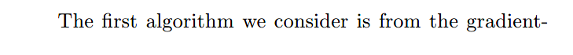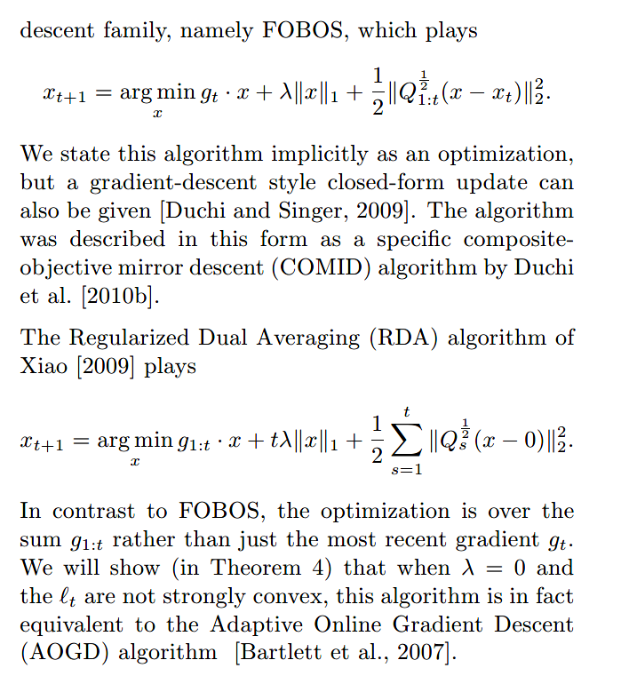

【译文】

​	我们考虑的第一个算法是来自梯度下降家族的`FOBOS`，如下：
$$
x_{t+1}=\arg_x \min {g_t*x+t\lambda||x||_1+\frac{1}{2}\sum_{s=1}^{t}{||Q_{1:t}^{1/2}(x-x_t)||_2^2}}
$$

​	我们隐式地将该算法表述为一种优化，但也可以给出一种梯度下降式的封闭形式更新[Duchi和Singer, 2009]。Duchi等人将该算法描述为一种特殊的复合物镜下降(COMID)算法[2010b]。

​	Xiao[2009]的正则对偶平均算法（`RDA`）如下：
$$
x_{t+1}=\arg_x \min {g_{1:t}*x+t\lambda||x||_1+\frac{1}{2}\sum_{s=1}^{t}{||Q_s^{1/2}(x-0)||_2^2}}
$$
​	对比`FOBOS`，`RDA`是用累积梯度$g_{1:t}$，而不仅仅是$g_t$。我们将在定理4证明当$\lambda=0$以及$l_t$不是强凸时，该算法（`RDA`）实际上等价于在线自适应梯度下降法（`AOGD`）[Bartlett et al., 2007]

【原文】

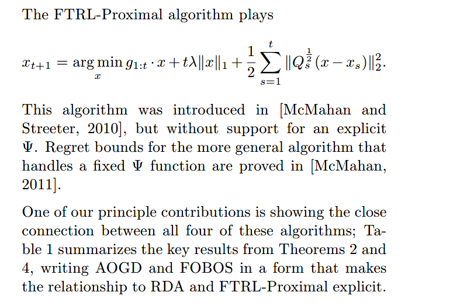

【译文】

​	FTRL-Proximal算法如下：
$$
x_{t+1}=\arg_x \min {g_{1:t}*x+t\lambda||x||_1+\frac{1}{2}\sum_{s=1}^{t}{||Q_s^{1/2}(x-x_s)||_2^2}}
$$
​	该算法在 [McMahan and Streeter, 2010]的论文中有介绍，但是没有支持显示的$\Phi$，而[McMahan, 2011]证明了处理固定$\Phi$函数的更一般算法的遗憾界

​	我们的主要贡献之一就是展示了这四种算法之间的紧密联系;表1总结了定理2和定理4的关键结果，以使与RDA和FTRL-Proximal的关系显式的形式编写了AOGD和FOBOS。

【原文】

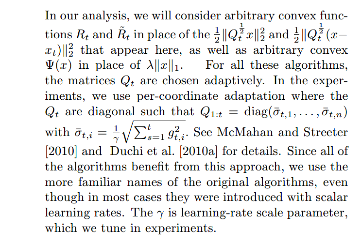

【译文】

​	在我们的分析中，我们将用任意凸函数$R_t$和$\hat{R_t}$来代替上面出现的$\frac{1}{2}||Q_t^{1/2}x||_2^2$和$\frac{1}{2}$