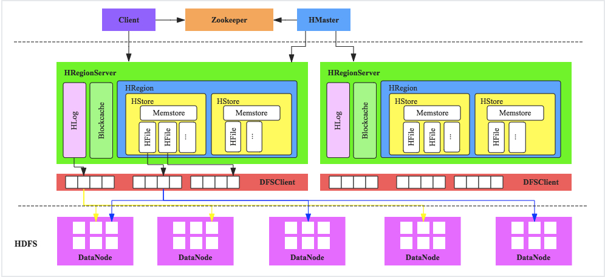
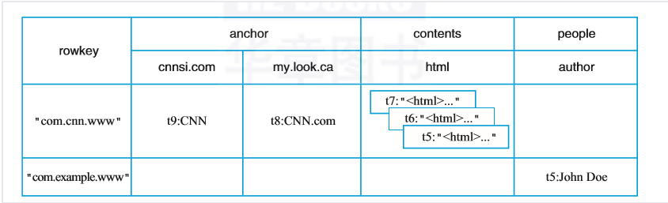

# HBase基础

## 简介

```markdown
	HBase是一个开源的非关系型分布式数据库（NoSQL），它参考了谷歌的BigTable建模，实现的编程语言为 Java。它是Apache软件基金会的Hadoop项目的一部分，运行于HDFS文件系统之上，为 Hadoop 提供类似于BigTable 规模的服务。因此，它可以对稀疏文件提供极高的容错率。
	
	HBase是一个分布式的、面向列的开源数据库，该技术来源于 Fay Chang 所撰写的Google论文“Bigtable：一个结构化数据的分布式存储系统”。就像Bigtable利用了Google文件系统（File System）所提供的分布式数据存储一样，HBase在Hadoop之上提供了类似于Bigtable的能力。HBase是Apache的Hadoop项目的子项目。HBase不同于一般的关系数据库，它是一个适合于非结构化数据存储的数据库。另一个不同的是HBase基于列簇的而不是基于行的模式。
```

## 体系结构



* 客户端

  ```markdown
  	HBase客户端（Client）提供了Shell命令行接口、原生Java API编程接口、Thrift/REST API编程接口以及MapReduce编程接口。支持所有常见的DML操作以及DDL操作，包括表的创建、删除、修改，以及数据的插入、删除、更新、读取等。其中Thrift/REST API主要用于支持非Java的上层业务需求，MapReduce接口则主要用于批量数据导入以及批量数据读取。
  ```

* Master

  ```markdown
  	负责处理用户的各种管理请求，包括建表操作、修改表操作、权限操作、切分表操作、合并数据分片操作以及Compaction操作；管理集群中所有RegionServer，包括RegionServer中Region的负载均衡、RegionServer的宕机恢复以及Region的迁移；负责过期日志以及文件的清理工作，Master会每隔一段时间检查HDFS中HLog是否过期、HFile是否已经被删除，并在过期之后会将其删除。
  ```

* RegionServer

  * WAL(HLog)

    ```markdown
    	HLog在HBase中有两个核心作用，其一用于实现数据高可靠，HBase数据随机写入并不是直接写入文件，而是先写入缓存，再异步刷新落盘。为了防止缓存数据丢失，数据写入缓存之前需要首先顺序写入HLog，通过这种方式，即使缓存数据丢失，仍然可以通过HLog日志恢复。其二用于实现HBase集群间主从复制，从集群通过回放主集群推送过来的HLog日志实现主从复制。
    ```

  * BlockCache

    ```markdown
    	HBase系统中的读缓存，客户端从磁盘读取数据之后通常会将数据缓存到系统内存中，后续访问同一行数据可以直接从内存中获取而不需要访问磁盘。对于带有大量热点读的业务请求来说，缓存机制会带来极大的性能提升。
    ```

  * Region

    ```markdown
    	数据表的一个分片，当数据表大小超过一定阈值就会“水平切分”，分裂为两个Region。Region是集群负载均衡的基本单位。通常一张表的Region会分布在整个集群的多台RegionServer上，一个RegionServer上会管理多个Region，当然，这些Region一般来自不同的数据表
    ```

* HDFS

  ```markdown
  	HBase底层依赖于HDFS组件存储实际数据，包括用户数据文件、HLog日志文件等等最终都会写入HDFS落盘。HDFS是Hadoop生态圈内最成熟的组件之一，数据默认三副本存储策略可以有效保证数据的高可靠性。HBase内部封装了一个称为DFSClient的HDFS客户端组件负责对HDFS的实际数据进行读写访问。
  ```

## 逻辑视图



* table

  ```markdown
  	表，一个表包含多行数据。
  ```

* row

  ```markdown
  	行，一行数据包含一个唯一标识rowkey、多个column以及对应的值。在HBase中，一张表中所有row都按照rowkey的字典序由小到大排序。
  ```

* column

  ```markdown
  	列，与关系型数据库中的列不同，HBase中的column由column family（列簇）以及qualifier（列名）两部分组成，两者中间使用"："相连，比如contents：html，其中contents为列簇，html为列簇下具体一列。column family在表创建的时候需要指定，用户不能随意增减。一个column family下可以设置任意多个qualifier，因此可以理解为HBase中的列可以动态增加，理论上甚至可以扩展到上百万列。
  ```

* cell

  ```markdown
  	单元格，由5元组（row，column，timestamp，type，value）组成的结构，其中type表示Put/Delete这样的操作类型，timestamp代表这个cell的版本。这个结构在数据库中实际是以KV结构存储的，其中（row，column，timestamp，type）是K，value字段对应KV的V。
  ```

* timestamp

  ```markdown
  	时间戳，每个cell在写入HBase的时候都会默认分配一个时间戳作为该cell的版本，当然，用户也可以在写入的时候自带时间戳。HBase支持多版本特性，即同一rowkey、column下可以有多个value存在，这些value使用timestamp作为版本号，版本越大，表示数据越新。
  ```

## 优缺点

### 优点

* 容量巨大

  ```markdown
  	HBase的单表可以支持千亿行、百万列的数据规模，数据容量可以达到TB甚至PB级别。传统的关系型数据库，如Oracle和MySQL等，如果单表记录条数超过亿行，读写性能都会急剧下降，在HBase中并不会出现这样的情况。
  ```

* 良好的可扩展性

  ```markdown
  	HBase集群可以非常方便地实现集群容量扩展，主要包括数据存储节点扩展以及读写服务节点扩展。HBase底层数据存储依赖于HDFS系统，HDFS可以通过简单地增加DataNode实现扩展，HBase读写服务节点也一样，可以通过简单的增加RegionServer节点实现计算层的扩展。
  ```

* 稀疏性

  ```markdown
  	HBase支持大量稀疏存储，即允许大量列值为空，并不占用任何存储空间。这与传统数据库不同，传统数据库对于空值的处理是占用一定存储空间的，这会造成一定程度的存储空间浪费。因此可以使用HBase存储多至上百万列的数据，即使表中存在大量的空值，也不需要任何额外空间。
  ```

* 高性能

  ```markdown
  	HBase目前主要擅长于OLTP场景，数据写操作性能强劲，对于随机单点读以及小范围的扫描读性能也能够得到保证。对于大范围的扫描读可以使用MapReduce提供的API实现更高效的并行扫描。
  ```

* 多版本

  ```markdown
  	HBase支持多版本特性，一个KV可以同时保留多个版本，用户可以根据需要选择最新版本或者某个历史版本。
  ```

* 支持过期

  ```markdown
  	HBase支持TTL过期特性，用户只需要设置过期时间，超过TTL的数据就会自动被清理，不需要用户写程序手动删除。
  ```

* Hadoop原生支持

  ```markdown
  	HBase是Hadoop生态中的核心成员之一，很多生态组件都可以与其直接对接。HBase数据存储依赖于HDFS，这样的架构可以带来很多好处，比如用户可以直接绕过HBase系统操作HDFS文件，高效地完成数据扫描或者数据导入工作；再比如可以利用HDFS提供的多级存储特性（Archival Storage Feature）将HBase根据业务的重要程度进行分级存储，将重要的业务放到SSD，将不重要的业务放到HDD。或者用户可以设置归档时间，进而将最近的数据放在SSD，将归档数据文件放在HDD。另外，HBase对MapReduce的支持也已经有了很多案例，后续还会针对spark做更多的工作。
  ```

### 缺点

* HBase本身不支持很复杂的聚合运算（Join、GroupBy等）

  ```markdown
  	如果业务中需要使用到聚合运算，可以在HBase之上架设Phoenix组件或者Spark组件，前者主要应用于小规模聚合的OLTP场景，后者应用于大规模聚合的OLAP场景。
  ```

* HBase本身并没有实现二级索引功能

  ```markdown
  	所以不支持二级索引查找。
  ```

* HBase原生不支持全局跨行事务

  ```markdown
  	只支持单行事务模型。
  ```

## 应用场景

* 写密集型应用，每天写入量巨大，而相对读数量较小的应用，比如IM的历史消息，游戏的日志等等
* 高并发 key-value 存储的场景；例如 HBase 可以作为实时计算( Storm )等的中间表和结果表，存储计算结果
* 不需要复杂查询条件来查询数据的应用：HBase只支持基于rowkey的查询，对于HBase来说，单条记录或者小范围的查询是可以接受的，大范围的查询由于分布式的原因，可能在性能上有点影响，而对于像SQL的join等查询，HBase无法支持。
* 数据结构比较简单，表结构的列族经常需要调整的场景

# Getting Started

## 1. Introduction

* single-node
* standalone

## 2. 操作

### 2.1 启动

```shell
$ ./bin/hbase shell
hbase(main):001:0>
```

### 2.2 建表

* 必须指定表名`test`和列名`cf`

```hbase
hbase(main):001:0> create 'test', 'cf'
0 row(s) in 0.4170 seconds

=> Hbase::Table - test
```

### 2.3 列出表信息

```hbase
hbase(main):002:0> list 'test'
TABLE
test
1 row(s) in 0.0180 seconds

=> ["test"]
```

```hbase
hbase(main):003:0> describe 'test'
Table test is ENABLED
test
COLUMN FAMILIES DESCRIPTION
{NAME => 'cf', VERSIONS => '1', EVICT_BLOCKS_ON_CLOSE => 'false', NEW_VERSION_BEHAVIOR => 'false', KEEP_DELETED_CELLS => 'FALSE', CACHE_DATA_ON_WRITE => 'false', DATA_BLOCK_ENCODING => 'NONE', TTL => 'FOREVER', MIN_VERSIONS => '0', REPLICATION_SCOPE => '0', BLOOMFILTER => 'ROW', CACHE_INDEX_ON_WRITE => 'false', IN_MEMORY => 'false', CACHE_BLOOMS_ON_WRITE => 'false', PREFETCH_BLOCKS_ON_OPEN => 'false', COMPRESSION => 'NONE', BLOCKCACHE => 'true', BLOCKSIZE => '65536'}
1 row(s)
Took 0.9998 seconds
```

