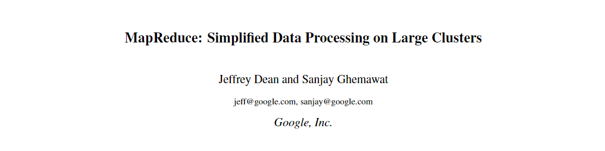

# 题目



【译文】

* MapReduce：大型集群上的简化数据处理

## 摘要

【原文】

```markdown
MapReduce is a programming model and an associated implementation for processing and generating large data sets. Users specify a map function that processes a key/value pair to generate a set of intermediate key/value pairs, and a reduce function that merges all intermediate values associated with the same intermediate key. Many real world tasks are expressible in this model, as shown in the paper.
Programs written in this functional style are automatically parallelized and executed on a large cluster of commodity machines. The run-time system takes care of the details of partitioning the input data, scheduling the program’s execution across a set of machines, handling machine failures, and managing the required inter-machine communication. This allows programmers without any experience with parallel and distributed systems to easily utilize the resources of a large distributed system.
Our implementation of MapReduce runs on a large cluster of commodity machines and is highly scalable: a typical MapReduce computation processes many terabytes of data on thousands of machines. Programmers find the system easy to use: hundreds of MapReduce programs have been implemented and upwards of one thousand MapReduce jobs are executed on Google’s clusters every day.
```

【译文】

```markdown
MapReduce是用于处理和生成大数据集的编程模型（相关的实现）。 用户指定key\value对以生成一组中间key\value对的map函数，以及指定归纳与同一中间key\value关联的所有中间key\value的reduce函数。 如本文所示，许多现实世界的任务在这种模型中都是可以表达的。
用这种函数式编写的程序会自动并行化，并在大型计算机集群上执行。运行时系统负责对输入数据进行分区、安排跨机器的程序执行、处理机器故障和管理所需的机器间通信等细节。这使得没有任何并行和分布式系统经验的程序员可以轻松地利用大型分布式系统的资源。
我们的MapReduce实现运行在大量的普通机器上，并且具有高度的可伸缩性:典型的MapReduce计算在数千台机器上处理许多TB级的数据。程序员发现这个系统很容易使用:已经实现了数百个MapReduce程序，每天在谷歌集群上执行的MapReduce任务都超过1000个。
```

【重点】

* 